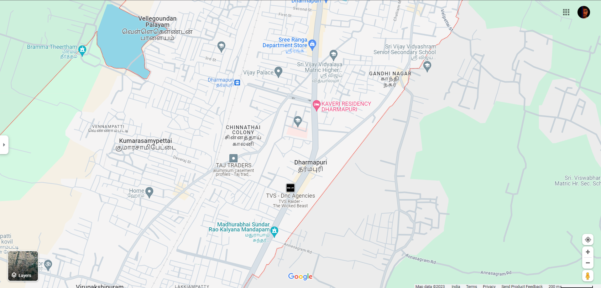

# Ex04 Places Around Me
## Date: 22.11.23

## AIM
To develop a website to display details about the places around my house.

## DESIGN STEPS

### STEP 1
Create a Django admin interface.

### STEP 2
Download your city map from Google.

### STEP 3
Using ```<map>``` tag name the map.

### STEP 4
Create clickable regions in the image using ```<area>``` tag.

### STEP 5
Write HTML programs for all the regions identified.

### STEP 6
Execute the programs and publish them.

## CODE
```
map.html

<html>
    <head>
        <title>My City</title>
    </head>
    <body>
        <h1 align="center">
            <font color=""red><b>Dharmapuri</b></font>
        </h1>
        <h3 align="center">
            <font color="blue"><b>Arunmozhi Varman T (23002304)</b></font>
        </h3>
        <center>
            
            <map name="MyCity">
                <area shape="rect" coords="900,50,1200,200" href="gandhinagar.html" title="Gandhi nagar">
                <area shape="rect" coords="600,300,900,600" href="dharmapuri.html" title="Dharmapuri">
                <area shape="rect" coords="500,200,900,300" href="chinnathaicolony.html" title="Chinnathai Colony">
                <area shape="rect" coords="300,20,500,100" href="vellegoundanpalayam.html" title="Vellegoundan Palayam">
                <area shape="rect" coords="300,200,600,400" href="kumarasamypettai.html" title="Kumarasamypettai">
            </map>
        </center>
    </body>
</html>


Kumarasamypettai.html

<html>
<head>
<title>My Home Town</title>
</head>
<body bgcolor="yellow">
<h1 align="center">
<font color="red"><b>Kumarasamypettai</b></font>
</h1>
<h3 align="center">
<font color="blue"><b> my neighbouring village</b></font>
</h3>
<hr size="3" color="red">
<p align="justify">
<font face="Georgia" size="5">
    The Siva Subramanya Swamy Murugan Temple of KumarasamyPettai in the Dharmapuri district of Tamil Nadu is a revered Lord Murugan temple with a history dating back over 800 years. The temple gained significant popularity due to an incident that occurred about 100 years ago.
</p>
</body>
</html>

vellegoundanpalayam.html

<html>
<head>
<title>My Home Town</title>
</head>
<body bgcolor="red">
<h1 align="center">
<font color="yellow"><b>vellegoundanpalayam</b></font>
</h1>
<h3 align="center">
<font color="blue"><b>my neighbouring village</b></font>
</h3>
<hr size="3" color="red">
<p align="justify">
<font face="Georgia" size="5">
    According to Census 2011 information the location code or village code of Vellegoundan Palayam village is 643586. Vellegoundan Palayam village is located in Dharmapuri taluka of Dharmapuri district in Tamil Nadu, India. It is situated 3km away from Dharmapuri, which is both district & sub-district headquarter of Vellegoundan Palayam village. As per 2009 stats, Settikarai is the gram panchayat of Vellegoundan Palayam village.
</p>
</body>
</html>

chinnathaicolony.html

<html>
<head>
<title>My Home Town</title>
</head>
<body bgcolor="cyan">
<h1 align="center">
<font color="red"><b>Chinnathai Colony</b></font>
</h1>
<h3 align="center">
<font color="blue"><b> my neighbouring village</b></font>
</h3>
<hr size="3" color="red">
<p align="justify">
<font face="Georgia" size="5">
    Total infected patients are 1 in Dharmapuri District and total population of Dharmapuri District is 1502900. Total Infected Patients in Tamil Nadu State are 1708 .
</p>
</body>
</html>

dharumapuri.html

<html>
<head>
<title>My Home Town</title>
</head>
<body bgcolor="violet">
<h1 align="center">
<font color="red"><b>Dharmapuri</b></font>
</h1>
<h3 align="center">
<font color="blue"><b> my hometown</b></font>
</h3>
<hr size="3" color="red">
<p align="justify">
<font face="Georgia" size="5">
  It is the first district created in Tamil Nadu after the independence of India by splitting it from then- Salem district on 2 October 1965. Dharmapuri District is one of the major producers of mango in the state, fine quality granite is found in the district. It is also one of the main sericulture belts in the state.
</p>
</body>
</html>


gandhinagar.html

<html>
<head>
<title>My Home Town</title>
</head>
<body bgcolor="green">
<h1 align="center">
<font color="red"><b>Gandhinagar</b></font>
</h1>
<h3 align="center">
<font color="blue"><b> my neighbouring village</b></font>
</h3>
<hr size="3" color="red">
<p align="justify">
<font face="Georgia" size="5">
    Gandhinagar is a small Village/hamlet in Pappireddipatty Block in Dharmapuri District of Tamil Nadu State, India. It comes under Pappampadi Panchayath. It is located 39 KM towards South from District head quarters Dharmapuri. 3 KM from Pappampadi. 282 KM from State capital Chennai.
</p>
</body>
</html>

```


## OUTPUT


## RESULT
The program for implementing image maps using HTML is executed successfully.
